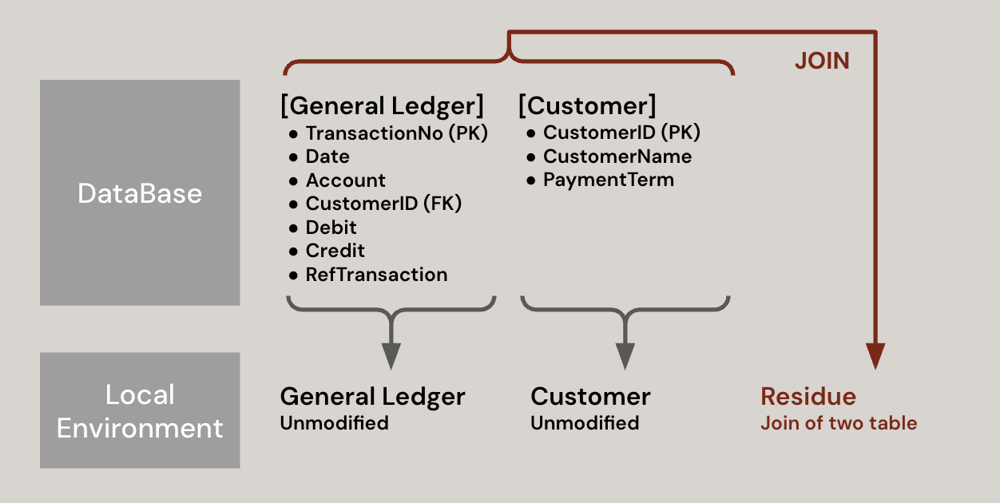
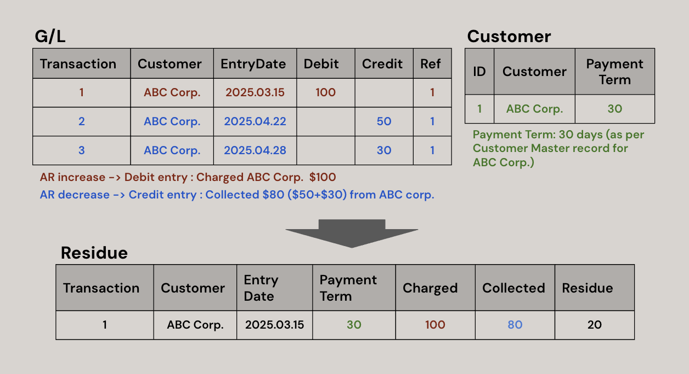
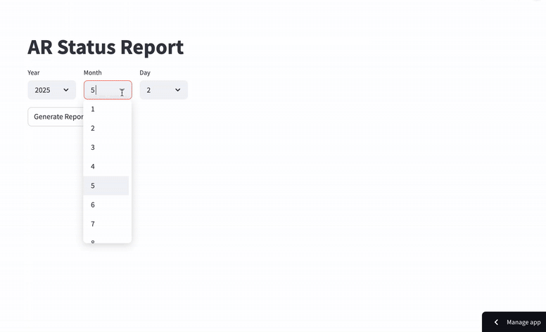

# Accounts Receivable Analysis   & Dashboard Development
[Check Out the Report(Dashboard)](https://worknotes-xqbeymbsbfam6keqsxxogx.streamlit.app)

## PROJECT OVERVIEW
In business, turning sales into real cash is just as crucial as making the sales themselves. Assuming the scenario of working in an organization or running an individual business—where a database already exists with transaction records stored as a general ledger, a standard structure in accounting used by most organizations—**The goal of this project is to effectively manage Accounts Receivable (AR) by analyzing raw transaction data (G/L) and generating reports or dashboards**.

### Process

## STEP1. Extract data from the DB ([Source Code]())
### `Generel Ledger` and `Customer`
As mentioned in the overview, this project assumes that a database already exists. To simulate this environment, I created a virtual General Ledger dataset that represents what an organization might use and established a local MySQL database. The first step was to import two unmodified tables—General Ledger and Customer Master—into pandas DataFrames. Additionally, I created a SQL query to join the two tables for further analysis(Residue).

### `Residue`
**Each row in the Residue Table** represents a debit entry from the General Ledger (G/L), which increases Accounts Receivable (AR) and **is treated as an individual invoice**. For each debit entry, the related credit entries are summed as the collected amount. The residue shows how much remains unpaid after applying these credits.

## STEP2. Manipulate the Dataset ([Source Code]())
**The key part of Step 2 is converting the `paymentTerm` column into a `paymentDue` date.**
The `paymentTerm` information comes from the `Customer` table in the database, with values such as 30, 60, or 90.

 - For example, a 30-day term means the payment is due at the end of the month following the billing month.
 - A 60-day term means the due date is at the end of the second month after the billing month, and so on.

**This `paymentDue` date is then used to calculate how many days have passed since the due date, helping assess the current status of each AR entry.**

## STEP3. Develop a Report (Dashboard) ([Source Code]())
**Based on the dataset `AR_status`, which is the result of the data manipulation process, an analysis report (or dashboard) was created.**
The report updates dynamically based on the date selected by the user and provides a snapshot of the current Accounts Receivable (AR) status.
It consists of two main sections: **Aging Summary** and **AR Details**.

**Aging Summary**  
The total amount of AR along with an aging analysis. Receivables are categorized based on how many days they are overdue:
 - Normal: before the payment due date
 - Pending: Overdue by 30 days or less
 - Risky: Overdue by more than 30 days

 **AR Details**  
The AR Details section displays a list of invoices that have not yet been collected.
Users can filter the list by AR category (Normal, Pending, Risky) using a scroll box for easy navigation.

### Final Output [Try it](https://worknotes-xqbeymbsbfam6keqsxxogx.streamlit.app)

