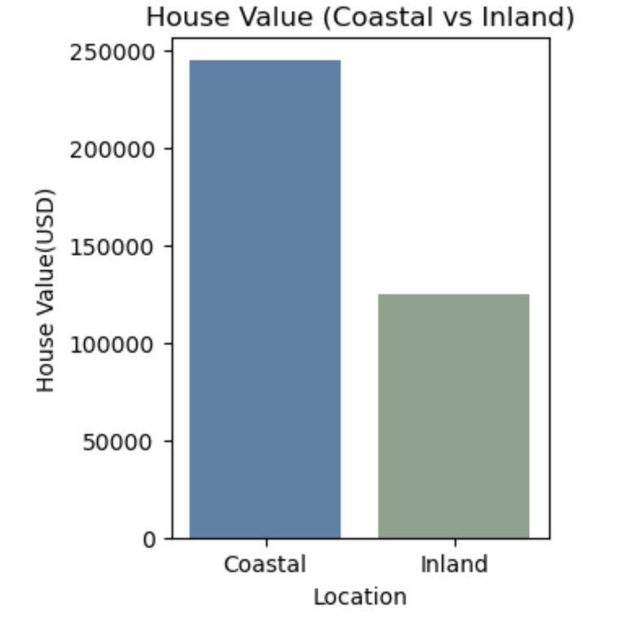
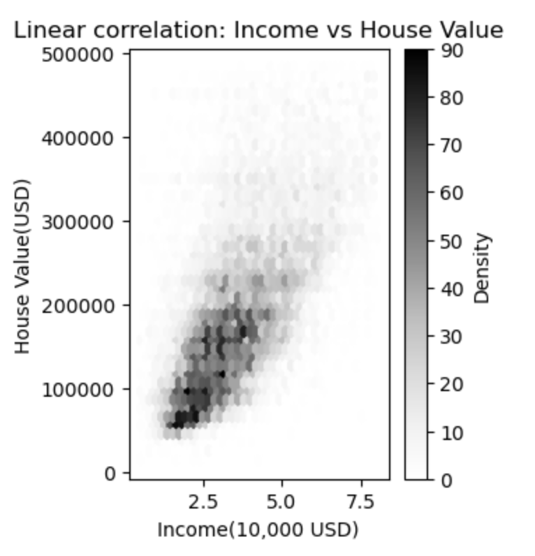

# Data Analysis on California Housing Prices
[Source From Kaggle](URL) <br>
[Jupyter Notebook](URL)

## 0. OVERVIEW ##
The project analyzes 1990s California housing prices, offering valuable insights into the key factors that determine housing values. While based on historical data, it provides a general understanding of housing market analysis. More importantly, this work is meaningful as I designed the process to apply analytical skills in practice, including data cleaning, visualization, and statistical analysis, to uncover trends and make informed predictions of data.

**Objective**
>**Descriptive Analysis** Identify key trends and patterns from the data <br>
>**Predictive Analysis** Estimate Housing valuse by key factors

**Methods**
>**Python Libraries** Pandas, Numpy, Seaborn, MatPlotLib, ScikitLearn

**Outcome**
>**Finding1** Coastal Areas Have Higher Housing Value <br>
>**Finding2** Correlation of Income and Housing Value <br>
>**Prediction Model** RandomForestRegressor with *R2Score: 0.82* and *RMSE: 48,671($)*


## 1. ABOUT DATASET
**Attributes**

>**Key Variable** House Value <br>
>**Housing Characteristic** Number of Rooms, Housing Age, Ocean Proximity <br>
>**Demographic Population** Households, Income <br>


## 2. Coastal Areas Have Higher Housing Values
### 2.1. Geographical visualization
**Steps Taken**
>Using geographical information (latitude, longitude), create a scatter plot where color represents ocean proximity and size varies by housing price. The visualization highlights that coastal areas tend to have higher housing values.

**Code Used** <br>
```
seaborn.scatterplot( )
```


### 2.2. Compare Housing Value between Coastal and Inland
**Steps Taken**
>After simplifying the ocean proximity feature into two categories (Coastal and Inland), a bar plot was used to directly compare house values. The average house value in coastal areas is nearly double that of inland areas.

**Code Used** <br>
```
dataframe.map()
dataframe.groupby()
seaborn.barplot()
```



## 3. Correlation of Income and Housing Values
### 3.1. Remove outliers in `income` column 
**Steps Taken**
>Among the features, the correlation between house value and income was found to be the highest. Before visualization, outliers above the upper whisker (Q3 + 1.5 * IQR) were removed to improve accuracy.

**Code Used** <br>
```
dataframe[‘column’].quantile()
 # used to calculate ICR and
 filter the column
```


### 3.2. Identify relationship Between Income and Housing Value
**Steps Taken**
>The relationship is visualized using a hexbin plot after removing outliers from both features (income and house value), showing a positive linear correlation.

**Code Used** <br>
```
matplotlib.pyplot.hexbin()
```



## 4. Prediction Model: Random Forest Regressor
*Each entry in the dataset represents a block featured by longitude and latitude. The median values are used for Housing age, Income and house Value*

**Key Features**
>**Housing Age** age of a house; a lower number is a newer <br>
>**Population** number of people <br>
>**Households** number of households, a group of people within a home unit <br>
>**Rooms** total number of rooms per household <br>
>**Income** of households <br>
>**Ocean Proximity** location of the house <br>

**Target**
>**House Value** of households

**Model**
>**Model type** RandomForestRegressor <br>
>**Performance** R2: 0.82  |  RMSE: 48,671($) <br>

## 5. Sampling Test with the Model: 75% of accuracy

**Test Strategy**
>From the cleaned dataset used for both training and testing the model, extract 5 random samples, each comprising 20% of the entire dataset, and test them individually. If the predicted value is within ±10% of the true value, the result is marked as Pass; otherwise, it is marked as Fail.

**Outcome**
>The model showed 75% accuracy, with predicted values falling within ±10% of the true values. However, further refinement is needed to improve the remaining 25%


    


