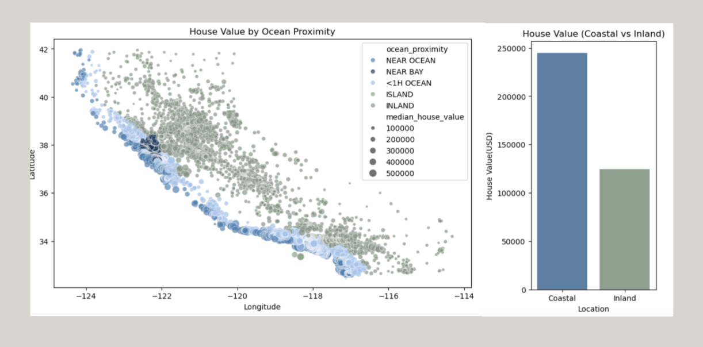
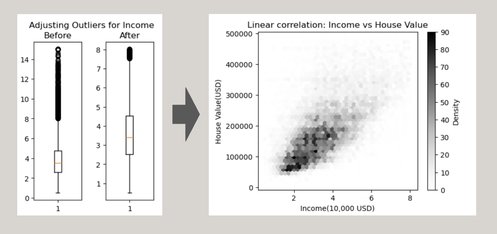

# Data Analysis on California Housing Prices
[Data Source (From Kaggle)](https://www.kaggle.com/datasets/camnugent/california-housing-prices)  
[Jupyter Notebook](https://github.com/TyKang0514/WorkNotes/blob/main/caliH/HousePricePred.ipynb)

## OVERVIEW ##
The 1990 California housing dataset, derived from the U.S. Census, includes information such as housing prices, median income, population, and geographic coordinates across more than 20,000 districts in California. **This project aims to apply key data analytics techniques—such as data cleaning, visualization, and predictive modeling—using this dataset to uncover meaningful insights and estimate housing values.**

> **Tools used** Python Libraries(Pandas, Numpy, Seaborn, MatPlotLib, ScikitLearn)

### ABOUT DATASET
Each entry represents a unit of area, described by its longitude and latitude.

>**key Variable** House Value  
>**Housing Characteristic** Number of Rooms, Housing Age, Ocean Proximity  
>**Demographic** Population, Households, Income

## FINDING 1. Coastal Areas Have Higher Housing Values

**Geographical Visualization**  
Using geographical data (latitude and longitude), a scatter plot was created where color indicates ocean proximity and marker size represents housing price. This visualization clearly highlights that coastal areas tend to have significantly higher housing values.

**Comparison between two area**  
To clarify the comparison, the ocean proximity variable—originally consisting of multiple categories such as NEAR BAY, NEAR OCEAN, INLAND, and others—was simplified into two groups: Coastal and Inland. A bar plot was then used to compare the average housing values between these two categories. The results show that the average house value in coastal areas is nearly twice as high as that in inland areas.

## FINDING 2. Correlation of Income and Housing Values

**Remove outliers in `income` column**  
Among the features, the correlation between house value and income was found to be the highest. Before visualization, outliers above the upper whisker (Q3 + 1.5 * IQR) were removed to improve accuracy.

**Identify relationship Between Income and Housing Value** 
The relationship is visualized using a hexbin plot after removing outliers from both features (income and house value), showing a positive linear correlation.

## Prediction Model: Random Forest Regressor

## Sampling Test with the Model: 75% of accuracy

    

