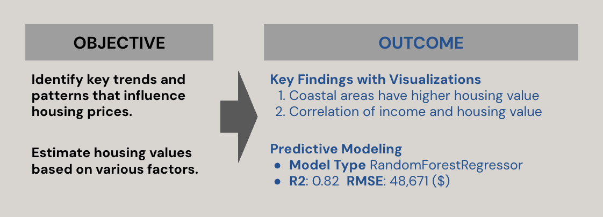

# Data Analysis on California Housing Prices
[Jupyter Notebook](https://github.com/TyKang0514/WorkNotes/blob/main/caliH/HousePricePred.ipynb)

## 0. OVERVIEW ##
The project analyzes 1990s California housing prices, offering valuable insights into the key factors that determine housing values. While based on historical data, it provides a general understanding of housing market analysis. More importantly, this work is meaningful as I designed the process to apply analytical skills in practice, including data cleaning, visualization, and statistical analysis, to uncover trends and make informed predictions of data.



## 1. ABOUT DATASET
**Attributes**

>**Key Variable** House Value <br>
>**Housing Characteristic** Number of Rooms, Housing Age, Ocean Proximity <br>
>**Demographic Population** Households, Income <br>


## 2. Coastal Areas Have Higher Housing Values
### 2.1. Geographical visualization
**Steps Taken**
>Using geographical information (latitude, longitude), create a scatter plot where color represents ocean proximity and size varies by housing price. The visualization highlights that coastal areas tend to have higher housing values.

**Code Used** <br>
```
seaborn.scatterplot( )
```


### 2.2. Compare Housing Value between Coastal and Inland
**Steps Taken**
>After simplifying the ocean proximity feature into two categories (Coastal and Inland), a bar plot was used to directly compare house values. The average house value in coastal areas is nearly double that of inland areas.

**Code Used** <br>
```
dataframe.map()
dataframe.groupby()
seaborn.barplot()
```


## 3. Correlation of Income and Housing Values
### 3.1. Remove outliers in `income` column 
**Steps Taken**
>Among the features, the correlation between house value and income was found to be the highest. Before visualization, outliers above the upper whisker (Q3 + 1.5 * IQR) were removed to improve accuracy.

**Code Used** <br>
```
dataframe[‘column’].quantile()
 # used to calculate ICR and filter the column
```


### 3.2. Identify relationship Between Income and Housing Value
**Steps Taken**
>The relationship is visualized using a hexbin plot after removing outliers from both features (income and house value), showing a positive linear correlation.

**Code Used** <br>
```
matplotlib.pyplot.hexbin()
```


## 4. Prediction Model: Random Forest Regressor


## 5. Sampling Test with the Model: 75% of accuracy


    


