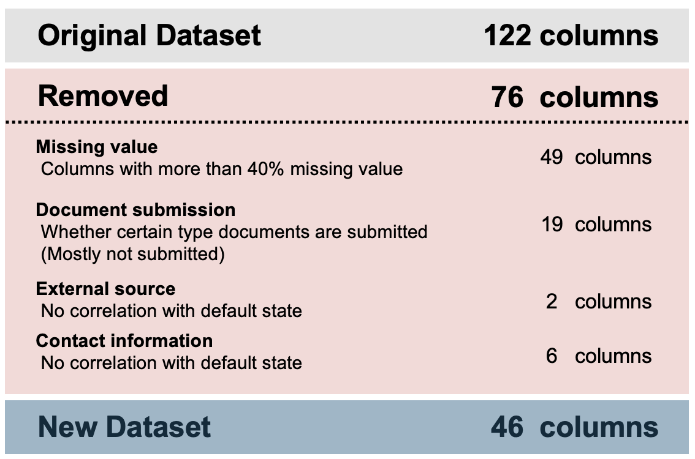

# Loan Default Risk Analysis
[Also find Jupyter Notebook here]()

## 0. OVERVIEW ##

This project explores various types of information extracted from loan application forms and identifies groups of features associated with a higher risk of default.

**Objective**
> Identify the features that contribute to an increased default rate.

**Methods**
>**Python Libraries** Pandas, Numpy, Seaborn, MatPlotLib

**Outcome**
>**Finding1** ... <br>
>**Finding2** ... <br>

## 1.About Dataset
**Sorce from Kaggle**

**Size**
>**Index 307511 | Column 122**
>```
>df.info()
>```
>


**Attributes**
> **Key Variable** Default status (0:no default | 1: default) <br>
> **General Demographics** Gender, Family (number of dependents), Education<br>
> **Employment & Income** Income, Organization, Property ownership (housing and car)
> **Loan-related Information** Loan amount, Loan type, Loan purpose(objective goods)
>
> ***Note**: The actual dataset contains more detailed columns and uses different labels. The above grouping is a generalized representation for clarity*

## 2. Identify unnecessary column


### 2.1. Missing Value (49 columns deleted)
**Steps Taken**
> Add a group of columns with more than 40% missing values into a list labeled `column_unnecessary`

**Code Used** 
>```
># make a series of null value percentage of each column
>columnlist_null = df.isnull().sum() / df.shape[0] * 100
>
># make a list that contains the column which has more than 40% of null value
>column_unnecessary = columnlist_null[columnlist_null>40].index.tolist()
>```

### 2.2. Documents submission (19 columns deleted)
**Steps Taken**
> A set of columns indicates whether certain documents were submitted. However, since most of them were not submitted, they provide little meaningful information, except for 'document3.
>
> **Code Used** 
>```
>FlagDocCol = []
>
>for x in df.columns:
>    if 'FLAG_DOCUMENT' in x :
>        FlagDocCol.append(x)
>
>df[FlagDocCol].sum()   
>```

### 2.3. Exgternal source (2 colums deleted)
**Steps Taken**
> Several columns labeled "external source" have ambiguous meanings. No clear correlation was found between these external sources and loan default.
