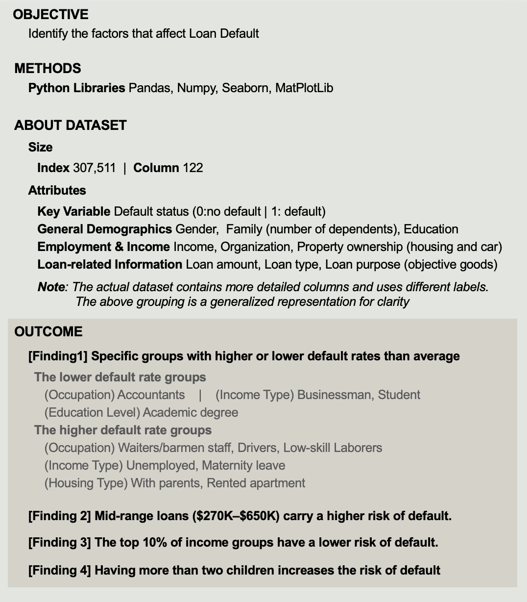
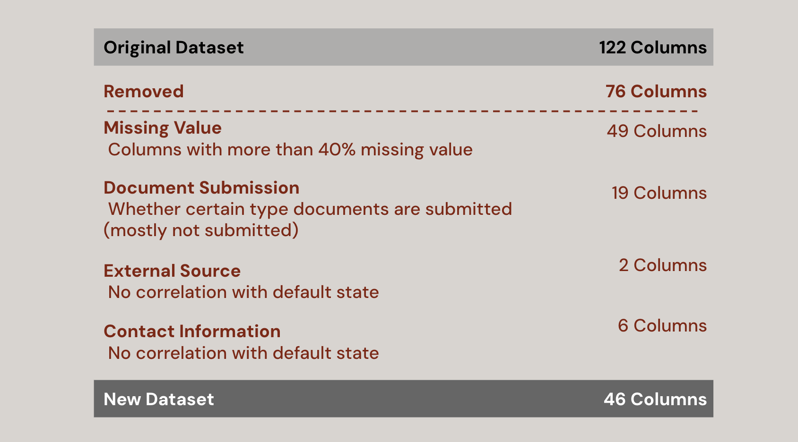
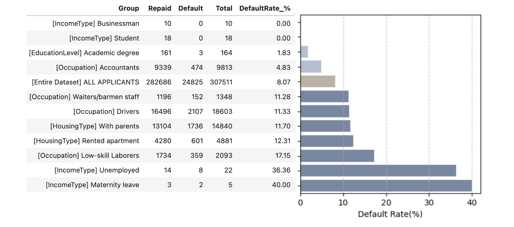
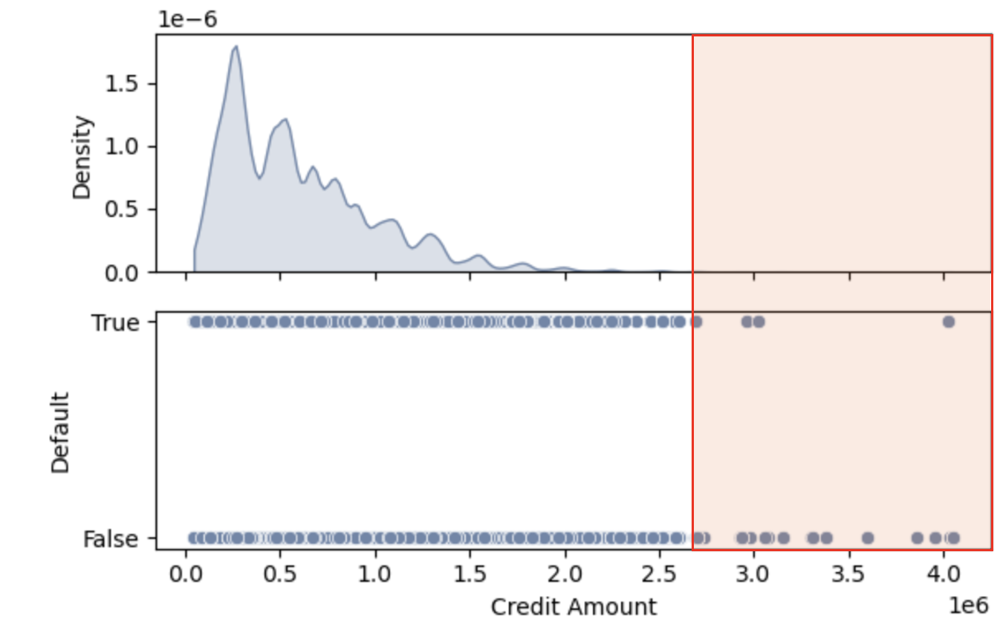
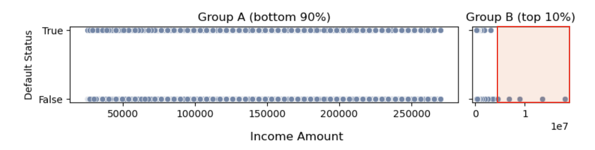

# Loan Default Risk Analysis
[Original Jupyter Notebook]() <br>
[Data Source (From Kaggle)]()

## 0. PROJECT OVERVIEW
The project explores various types of information extracted from loan application forms and identifies groups of features associated with a higher risk of default.




## 1. Identify unnecessary column
To narrow the range of features for analysis, unnecessary columns were deleted, including those with more than 40% missing values, columns related to document submission where most items were not submitted, and other columns with ambiguous meanings or lacking clear information.


## 2. Categorical Data Analysis
**Strategy**
1. Group the data by the values in the categorical column.
2. Calculate the default rate for each group.
3. Identify the group with a defualt rate lower than 5% or higher than 11%. <br>
***Note** The default rate in the entire dataset (all applicants) is approximately 8%.*

### 2.1. Set the function for the analysis
Define a function that takes a categorical column as input and returns a DataFrame displaying the default rate for each category in the column


>```
>def defaultRate(col) : 
>    summary = df1.groupby(col)['TARGET'].agg(Repaid=lambda t: (t == 0).sum(),
>                                             Default=lambda t: (t == 1).sum(),
>                                             Total='size').reset_index()
>    summary['DefaultRate_%'] = (summary['Default'] / summary['Total']) * 100
>    summary = summary.rename(columns={col: 'Group'})
>    summary['Column']=col
>    summary = summary[['Column','Group','Repaid','Default','Total','DefaultRate_%']]
>    return round(summary,2)
>```

For example, when the column 'contract type' is provided to the function, it returns a DataFrame like the one shown below.
>```
>defaultRate('NAME_CONTRACT_TYPE')
>```
>

### 2.2. Noticeable Groups
Using the previously defined function, groups with a default rate below 5% and above 11% are identified. These ranges are determined based on a difference of more than 3% from the overall default rate of all applicants, which is 8%.



**The default rate across the entire dataset (all applicants) is 8.07%. Assuming a difference of 3% is significant, the identified groups with a default rate lower than 5% and higher than 11% are as follows:**
>**The lower default rate groups:**
>- [Occupation] Accountants
>- [IncomeType] Businessman, Student
>- [EducationLevel] Academic degree
>
>**The higher default rate groups**
>- [Occupation] Waiters/barmen staff, Drivers, Low-skill Laborers
>- [IncomeType] Unemployed, Maternity leave
>- [HousingType] With parents, Rented apartment

## 3. Numerical Data Analysis
**Strategy** <br>
Analyze numerical columns individually to identify specific ranges where the default rate is noticeably high or low compared to the overall default rate of the dataset


### 3.1. Credit Amount
This column represents the credit amount of the loan. To provide an overview of the distribution and examine how the default state changes across different credit amounts, a KDE (Kernel Density Estimate) and scatter plot were created
>```
># Set x-axis range
>x_min, x_max = df1['AMT_CREDIT'].min(), df1['AMT_CREDIT'].max()
>
># Create figure with two subplots, sharing the same x-axis
>fig, axes = plt.subplots(nrows=2, figsize=(6, 4), sharex=True, gridspec_kw={'height_ratios': [1, 1]})
>
># KDE plot
>sns.kdeplot(x=df1['AMT_CREDIT'], fill=True, clip=(x_min, x_max), ax=axes[0])
>axes[0].set_ylabel('Density')
>
># Scatter plot
>sns.scatterplot(x=df1['AMT_CREDIT'], y=df1['TARGET'], ax=axes[1])
>axes[1].set_yticks([0, 1])
>axes[1].set_yticklabels(["False", "True"])
>axes[1].set_ylabel('Default')
>
># X label
>plt.xlabel('Credit Amount')
>
># Adjust layout
>plt.tight_layout()
>
># Show the plots
>plt.show()
>```
>

As shown above, the majority of loans are under 1 million. And it is expected that in the range of extremely large credit amounts, there may be a decrease in the default rate.

To verify this inference, the dataset is split into 8 groups based on the quantiles of credit amount to compare their default rates.


Default rates show a **U-shaped** trend across credit amount groups. The lowest rates are in Q1 (6.87%) and Q8 (5.39%), while the highest are in mid-range groups Q3-Q5 (9.66%-10.65%).

**Smaller loans may indicate lower risks, and larger loans may reflect more stable borrowers. Mid-range loans likely represent higher-risk borrowers, emphasizing the importance of identifying specific credit amount ranges associated with higher default risks.**

### 3.2. Income


Two noticeable aspects of the column are the presence of extreme outliers (up to $117,000,000) and a high concentration of data within a specific range (below the 90th percentile: $270,000). To address these characteristics, the analysis is divided into two groups:
- **Group A: Income from $0 to $270,000 (up to the 90th percentile)**
- **Group B: Income above $270,000**



The scatter plot implies that the default rate would change only after reaching Group B, while it remains steady in Group A. To verify this, it is necessary to examine how the default rate varies across income brackets within each group.


It was expected that the default rate wouldn’t change until reaching the top 10% of income. However, as shown above, a general trend of decreasing default rates exists across all income ranges. Nevertheless, **it is clear that the default rate decreases significantly when entering Group B (the top 10% of income)**.

### 3.3. Family Status
Regarding family status, there are two relevant columns: the number of children and the number of family members. However, these two columns have a very strong linear correlation, so only one of them, the number of children, is chosen for the analysis.


Although it is a numerical column, it can be treated as categorical because it has only a small number of unique values. Therefore, it is divided into 5 groups (no children, 1 child, 2 children, 3 children, above 3 children), and the default rate is checked for each group.


**End of the document**
