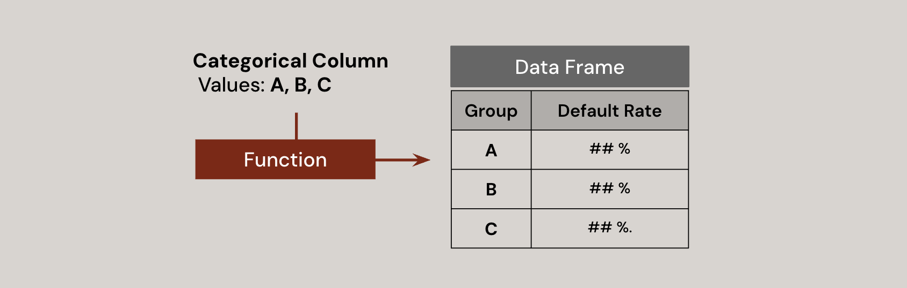

# Loan Default Risk Analysis
[Also find Jupyter Notebook here]()

## 0. OVERVIEW ##

This project explores various types of information extracted from loan application forms and identifies groups of features associated with a higher risk of default.

### Objective
Identify the features that contribute to an increased default rate.
  
### Methods
>**Python Libraries** Pandas, Numpy, Seaborn, MatPlotLib

### Outcome
>**Finding1** ... <br>
>**Finding2** ... <br>

## 1.About Dataset
[Sorce from Kaggle]()

### Size
>**Index** 307,511 <br>
>**Column** 122

### Attributes
> **Key Variable** Default status (0:no default | 1: default) <br>
> **General Demographics** Gender, Family (number of dependents), Education<br>
> **Employment & Income** Income, Organization, Property ownership (housing and car) <br>
> **Loan-related Information** Loan amount, Loan type, Loan purpose(objective goods)
>
> ***Note**: The actual dataset contains more detailed columns and uses different labels. The above grouping is a generalized representation for clarity*

## 2. Identify unnecessary column


### 2.1. Missing Value (49 columns deleted)
Add a group of columns with more than 40% missing values into a list labeled `column_unnecessary`

>```
># make a series of null value percentage of each column
>columnlist_null = df.isnull().sum() / df.shape[0] * 100
>
># make a list that contains the column which has more than 40% of null value
>column_unnecessary = columnlist_null[columnlist_null>40].index.tolist()
>```

### 2.2. Documents submission (19 columns deleted)
A set of columns indicates whether certain documents were submitted. However, since most of them were not submitted, they provide little meaningful information, except for 'document3.
>```
># Most of documents are not submitted, except for document 3
>FlagDocCol = []
>
>for x in df.columns:
>    if 'FLAG_DOCUMENT' in x :
>        FlagDocCol.append(x)
>
>df[FlagDocCol].sum()   
>```
>
>
>```
>FlagDocCol.remove('FLAG_DOCUMENT_3')
>column_unnecessary = column_unnecessary + FlagDocCol 
>```

### 2.3. External source (2 columns deleted)
Several columns labeled "external source" have ambiguous meanings. No clear correlation was found between these external sources and loan default.

### 2.4. Contact Information (6 columns deleted)
Personal contatct information is also unnecessary

### 2.5 New dataframe with the adjusted columns
Create a new dataframe `df1` with adjusted columns

>```
>df1=df.loc[:,[x for x in originalcolumn if x not in column_unnecessary]]
>```

## 3. Categorical Data Analysis
**Strategy**
1. Group the data by the values in the categorical column.
2. Calculate the default rate for each group.
3. Identify the group with a defualt rate lower than 5% or higher than 11%. <br>
***Note** The default rate in the entire dataset (all applicants) is approximately 8%.*

### 3.1. Set the function for the analysis
Define a function that takes a categorical column as input and returns a DataFrame displaying the default rate for each category in the column



>```
>def defaultRate(col) : 
>    summary = df1.groupby(col)['TARGET'].agg(Repaid=lambda t: (t == 0).sum(),
>                                             Default=lambda t: (t == 1).sum(),
>                                             Total='size').reset_index()
>    summary['DefaultRate_%'] = (summary['Default'] / summary['Total']) * 100
>    summary = summary.rename(columns={col: 'Group'})
>    summary['Column']=col
>    summary = summary[['Column','Group','Repaid','Default','Total','DefaultRate_%']]
>    return round(summary,2)
>```

For example, when the column 'contract type' is provided to the function, it returns a DataFrame like the one shown below.
>```
>defaultRate('NAME_CONTRACT_TYPE')
>```
>

### 3.2. Noticeable Groups
Using the previously defined function, groups with a default rate below 5% and above 11% are identified. These ranges are determined based on a difference of more than 3% from the overall default rate of all applicants, which is 8%.


**The default rate across the entire dataset (all applicants) is 8.07%. Assuming a difference of 3% is significant, the identified groups with a default rate lower than 5% and higher than 11% are as follows:**
>**The lower default rate groups:**
>- [Occupation] Accountants
>- [IncomeType] Businessman, Student
>- [EducationLevel] Academic degree
>
>**The higher default rate groups**
>- [Occupation] Waiters/barmen staff, Drivers, Low-skill Laborers
>- [IncomeType] Unemployed, Maternity leave
>- [HousingType] With parents, Rented apartment

## 4. Numerical Data Analysis
**Strategy** <br>
Analyze numerical columns individually to identify specific ranges where the default rate is noticeably high or low compared to the overall default rate of the dataset


### 4.1. Credit Amount
This column represents the credit amount of the loan. To provide an overview of the distribution and examine how the default state changes across different credit amounts, a KDE (Kernel Density Estimate) and scatter plot were created
>```
># Set x-axis range
>x_min, x_max = df1['AMT_CREDIT'].min(), df1['AMT_CREDIT'].max()
>
># Create figure with two subplots, sharing the same x-axis
>fig, axes = plt.subplots(nrows=2, figsize=(6, 4), sharex=True, gridspec_kw={'height_ratios': [1, 1]})
>
># KDE plot
>sns.kdeplot(x=df1['AMT_CREDIT'], fill=True, clip=(x_min, x_max), ax=axes[0])
>axes[0].set_ylabel('Density')
>
># Scatter plot
>sns.scatterplot(x=df1['AMT_CREDIT'], y=df1['TARGET'], ax=axes[1])
>axes[1].set_yticks([0, 1])
>axes[1].set_yticklabels(["False", "True"])
>axes[1].set_ylabel('Default')
>
># X label
>plt.xlabel('Credit Amount')
>
># Adjust layout
>plt.tight_layout()
>
># Show the plots
>plt.show()
>```
>

As shown above, the majority of loans are under 1 million. It is expected that in the range of extremely large credit amounts, there may be a decrease in the default rate.

To verify this inference, the dataset is split into 8 groups based on the quantiles of credit amount to compare their default rates


Default rates show a **U-shaped** trend across credit amount groups. The lowest rates are in Q1 (6.87%) and Q8 (5.39%), while the highest are in mid-range groups Q3-Q5 (9.66%-10.65%).

**Smaller loans may indicate lower risks, and larger loans may reflect more stable borrowers. Mid-range loans likely represent higher-risk borrowers, emphasizing the importance of identifying specific credit amount ranges associated with higher default risks.**

### 4.2. Income
Characteristc that stands out in the column is that it has extreme outliers and most of the data is concentrated in a certain range

